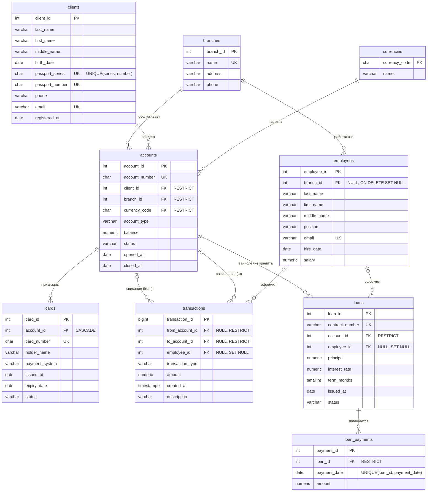

```mermaid
erDiagram
    branches ||--o{ employees     : "работают в"
    branches ||--o{ accounts      : "обслуживает"
    clients  ||--o{ accounts      : "владеет"
    currencies ||--o{ accounts    : "валюта"
    accounts ||--o{ cards         : "привязаны"
    accounts |o--o{ transactions  : "списание (from)"
    accounts |o--o{ transactions  : "зачисление (to)"
    employees |o--o{ transactions : "оформил"
    accounts ||--o{ loans         : "зачисление кредита"
    employees |o--o{ loans        : "оформил"
    loans    ||--o{ loan_payments : "погашается"

    branches {
        int branch_id PK
        varchar name UK
        varchar address
        varchar phone
    }
    employees {
        int employee_id PK
        int branch_id FK "NULL, ON DELETE SET NULL"
        varchar last_name
        varchar first_name
        varchar middle_name
        varchar position
        varchar email UK
        date hire_date
        numeric salary
    }
    clients {
        int client_id PK
        varchar last_name
        varchar first_name
        varchar middle_name
        date birth_date
        char passport_series UK "UNIQUE(series, number)"
        char passport_number UK
        varchar phone
        varchar email UK
        date registered_at
    }
    currencies {
        char currency_code PK
        varchar name
    }
    accounts {
        int account_id PK
        char account_number UK
        int client_id FK "RESTRICT"
        int branch_id FK "RESTRICT"
        char currency_code FK "RESTRICT"
        varchar account_type
        numeric balance
        varchar status
        date opened_at
        date closed_at
    }
    cards {
        int card_id PK
        int account_id FK "CASCADE"
        char card_number UK
        varchar holder_name
        varchar payment_system
        date issued_at
        date expiry_date
        varchar status
    }
    transactions {
        bigint transaction_id PK
        int from_account_id FK "NULL, RESTRICT"
        int to_account_id FK "NULL, RESTRICT"
        int employee_id FK "NULL, SET NULL"
        varchar transaction_type
        numeric amount
        timestamptz created_at
        varchar description
    }
    loans {
        int loan_id PK
        varchar contract_number UK
        int account_id FK "RESTRICT"
        int employee_id FK "NULL, SET NULL"
        numeric principal
        numeric interest_rate
        smallint term_months
        date issued_at
        varchar status
    }
    loan_payments {
        int payment_id PK
        int loan_id FK "RESTRICT"
        date payment_date "UNIQUE(loan_id, payment_date)"
        numeric amount
    }
```

